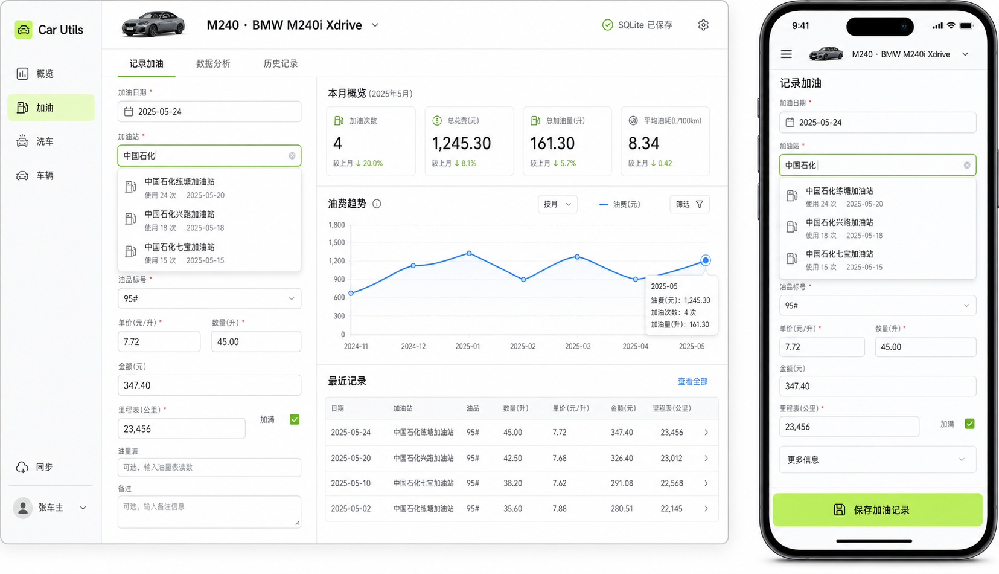

# Car Utils Web Design System

This document turns the approved high-fidelity reference into implementation rules for the Web app.



## Product Character

Car Utils is a practical vehicle ledger. The interface should feel precise, calm, and quick to operate rather than promotional.

- Use cool white surfaces and graphite text.
- Use petrol lime only for the active destination and primary action.
- Use data blue for charts and links.
- Use amber and red only for warnings and destructive states.
- Keep borders thin, shadows subtle, and radii between 6px and 8px.
- Prefer compact rows and aligned fields over large floating cards.

## Core Tokens

```css
--color-canvas: #f4f6f3;
--color-surface: #ffffff;
--color-surface-muted: #f7f8f6;
--color-text: #182019;
--color-text-muted: #697269;
--color-border: #dfe4dd;
--color-accent: #b9ef45;
--color-accent-soft: #effbd5;
--color-data: #2878e3;
--color-warning: #b77909;
--color-danger: #b33b2e;
--radius-sm: 6px;
--radius-md: 8px;
--sidebar-expanded: 224px;
--sidebar-collapsed: 68px;
```

## Application Shell

### Desktop

- The sidebar is fixed to the left edge and fills the viewport height.
- Product identity sits at the top; primary modules occupy the middle.
- Sync, account, and logout actions stay at the bottom.
- The main workspace uses a maximum width but does not float inside another card.
- The page header combines current vehicle context, page title, and persistence state.

### Mobile

- Replace the full sidebar with a compact top bar and menu trigger.
- Keep the current vehicle selector visible near the page title.
- Forms become a single column.
- Primary save actions remain reachable at the bottom of long forms.
- Horizontal scrolling is allowed only for tab strips and data tables, never for the whole page.

## Page Structure

Every module follows the same hierarchy:

1. Module header and current vehicle.
2. Module tabs.
3. Primary working area.
4. Contextual summaries, trends, or history.

The fuel record page uses a desktop two-column workspace:

- Left: the fuel form and station autocomplete.
- Right: monthly summary, trend chart, and recent records.

The wash page reuses the same pattern:

- Left: wash record form.
- Right: recent wash summary and product usage overview.

Vehicles, warehouse, and sync use dense lists or two-column settings sections rather than nested cards.

## Forms

- Use 40-42px inputs on desktop and at least 44px touch targets on mobile.
- Show required markers only for fields that block saving.
- Put optional and advanced fields under a clear secondary section on mobile.
- Use autocomplete for reusable historical text such as fuel stations.
- Use native selects for small finite choices such as fuel grade and wash type.
- Place calculated amounts next to the values that produce them.
- Use a single strong primary action per form.

## Data Display

- Summary values use four compact cells at desktop widths and two columns on mobile.
- Charts use data blue, light grid lines, and visible hover or touch tooltips.
- Desktop history uses aligned rows or a table; mobile history uses stacked records.
- Empty analytics should explain which data is missing instead of showing an empty chart.
- Persistence state is compact when healthy and prominent only when degraded.

## Accessibility

- Preserve keyboard navigation and visible focus states.
- Icon-only controls require accessible labels and tooltips.
- Do not encode status by color alone.
- Keep text contrast at WCAG AA or better.
- Respect reduced-motion preferences for any future transitions.

## Implementation Boundaries

- UI changes must not alter Store, JSON export, SQLite payload, or CloudBase encryption formats.
- Existing domain services and analytics remain the source of business behavior.
- New page components receive data and callbacks; they do not access repositories directly.
- Responsive verification targets are 1440x900 and 390x844.
